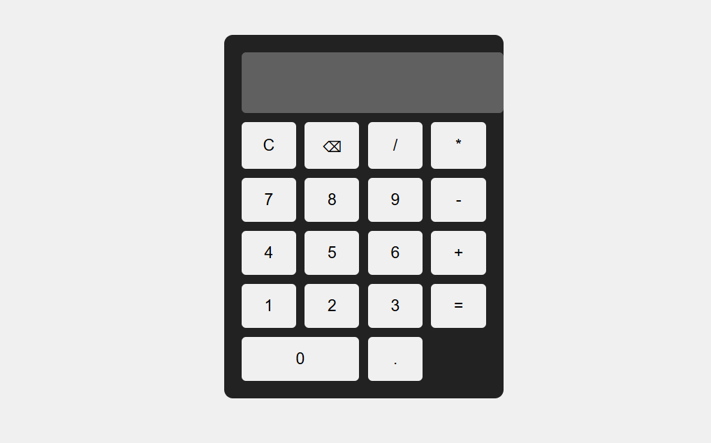

# 🧮 Calculator Web App – CodeAlpha Internship

This is a **basic Calculator Web Application** developed using **HTML, CSS, and JavaScript** as part of the **CodeAlpha Frontend Development Internship**.

The project performs basic arithmetic operations with a clean and responsive user interface.

---

## 📌 Project Overview

- Internship: CodeAlpha – Frontend Development
- Task: Build a Calculator
- Technologies: HTML, CSS, JavaScript
- Level: Beginner Friendly

---

## 🚀 Features

✔ Perform basic arithmetic operations (+, −, ×, ÷)  
✔ Interactive buttons-based UI  
✔ Real-time result display  
✔ Clear (C) and Delete functionality  
✔ Responsive design for different screen sizes  
✔ Clean and simple layout  

---

## 🛠️ Technologies Used

- HTML5  
- CSS3  
- JavaScript  
- GitHub  

---

## 📂 Project Structure

CodeAlpha_Build_Calculator/ │ ├── index.html ├── style.css ├── script.js └── README.m

---

## ▶️ How to Run the Project

1. Download or clone the repository  
2. Open `index.html` in any modern web browser  
3. Start using the calculator  

---

## 🌐 Live Demo (GitHub Pages)

👉 
Example: https://your-username.github.io/CodeAlpha_Build_Calculator/

---

## 📎 Internship Information

This project is completed as part of the **CodeAlpha Frontend Development Internship**, where interns are required to complete **2 or 3 tasks** from the provided task list.

### ✔ Completed Task:
- Build a Calculator using HTML, CSS & JavaScript

---

## 🙌 Acknowledgement

Thanks to **CodeAlpha** for providing this internship opportunity and hands-on learning experience.

---

## 👤 Author

**Mayur Gadhe**  
GitHub: https://github.com/mgadhe177-gif  
LinkedIn: https://www.linkedin.com/in/mayur-gadhe/

